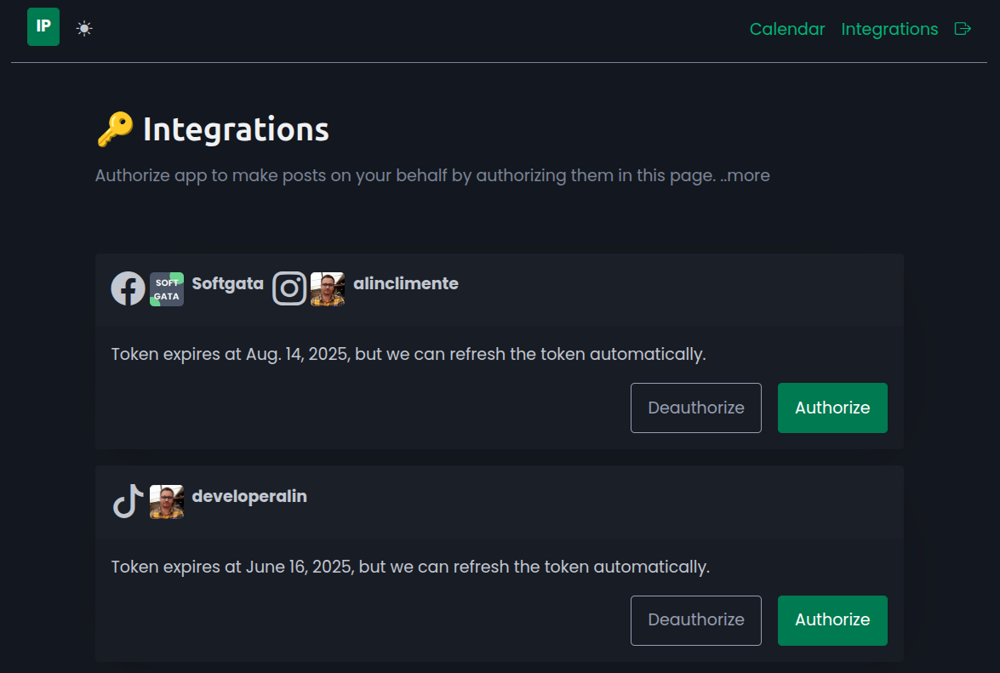
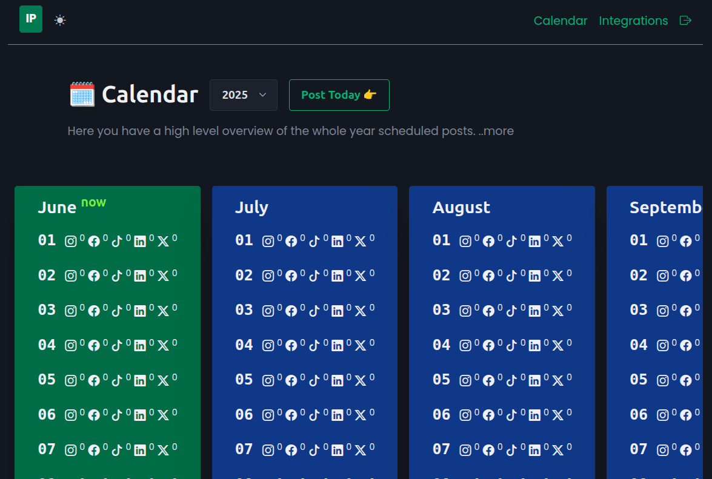
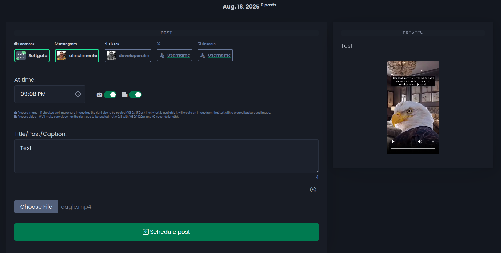

  <strong>
  <h2>A Simple (no fluff) Social Media Posts Scheduler</h2> 
  </strong>

  <a href="https://imposting.com/" target="_blank">
  <picture>
    <source media="(prefers-color-scheme: dark)" srcset="./static/android-chrome-512x512.png">
    
  </picture>
  </a>

<strong>
     <a href="https://imposting.com">imposting.com</a>
</strong>

Built with Django and AlpineJs. Schedule posts with text/image/link on Facebook public page, Instagram profesional account, TikTok business account, Linkedin, X. Deploy it yourself or contact me to help you deploy it.

## Key Features & Recent Improvements

* 💎 **PostFlow Glassmorphic UI**: A premium, completely redesigned user interface featuring dark/light themes, sleek card components, glassmorphism, micro-animations, and structured styles.
* 🔄 **Instagram Media Polling**: High-reliability posting on Instagram. The background poster polls Meta's Graph API for the media container's status (`FINISHED`/`ERROR`) before triggering publication.
* 🖼️ **Refined Image Processing**: Auto-resizes and optimizes uploaded images for social platform compliance. Post captions are passed in metadata descriptions instead of being burned onto the image canvas.
* 🛡️ **Avatar Handling safety**: Prevented server-side failures on user connection screens when third-party account profile avatars are missing or null.
* ⏱️ **Accurate Scheduling**: Scheduling runs exactly when requested, removing the previous automatic 5-minute offset delay.

## Get social media OAuth2 ids and secrets

For all of them you need to search for developer + X or developer + Linkedin etc. to go to the platform where you can create an app and get the keys needed for integrating with their api. Search for "How to make posts via Linkedin/X/Facebook/etc api" you will find some up to date docs on what steps you need to take. Check .env.example for the needed ids and secrets.

## Quickstart

While developing:
- `make dev` - start django app;
- `make poster` - start background social media poster (needs manual restarts on changes);

Use ngrok for `APP_URL` in `.env` file for Google auth callback and social media callbacks;

Project is using [uv](https://docs.astral.sh/uv/) for managing dependencies.

- `uv sync` - install all packages;
- `uv sync --upgrade` - install all packages at their latest versions;
- `uv add package` - add a package in dependencies;
- `uv remove package` - remove a package from dependencies;

Shortcut make commands:

- `make migrate-all` - migrate all models changes;
- `make purge-db` - delete all data and migration dirs;
- `make poster` - start post scheduler;
- `docker network create web` - one time thing;
- `make start` - start app in docker;
- `make stop` - stop app in docker;
- `make build` - build app in docker;
- `make applogs` - show app logs in docker;

## Google SignIn Configuration

- Google [google console](https://console.cloud.google.com/);
- Create a new project;
- Configure OAuth2 consent page;
- Setup Branding (name, support email, logo, app domain, authorized domain) - that's when app goes to prod;
- In Clients page click `Create client` button add name set authorized JS origins (http://ngrok-for-dev for dev, http://ngrok-for-dev/complete/google-oauth2/ for dev redirect uri). Change it with your domain once app is ready for prod.
- Download secrets (you have later access to them as well);
- In the `.env` file fill `SOCIAL_AUTH_GOOGLE_OAUTH2_KEY` and `SOCIAL_AUTH_GOOGLE_OAUTH2_SECRET` with Cliend ID and Client Secret taken from previously downloaded json file with secrets;

## Facebook && Instagram

- You'll need a Facebook Public Page and an Instagram Professional account linked into Meta bussiness account;
- Google [meta developer social technologies](https://developers.facebook.com/);
- Create an app;
- Setup `Facebook login for business` there in add Settings:
    - OAuth Redirect URIs: https://ngrok-or-prod-url.app/facebook/callback;
    - Allowed Domains for the JavaScript SDK: ngrok-or-prod-url.app;
    - Deauthorize callback URL: https://ngrok-or-prod-url.app/facebook/uninstall/;
    - Data Deletion Request URL: https://ngrok-or-prod-url.app/facebook/uninstall/;
    - Save changes;
- Get App ID (FACEBOOK_CLIENT_ID) and App secret (FACEBOOK_CLIENT_SECRET) from App Settings > Basic and fill .env file;

## X

- A single X account is enough here;
- Google [x developer portal](https://developer.x.com/en/portal/dashboard);
- Create an app and generate OAuth 2.0 Client ID and Client Secret save them to .env;
- On User authentication settings click Edit button;
- Select Type of App > Web App and fill Callback URI / Redirect URL > https://ngrok-or-prod-url.app/X/callback/;
- Add your website url;
- Click Save button;

## Linkedin

- You'll need a Linkedin Company Page, posts will be made to the Linkedin account not the company page;
- Google [linkedin developer](https://developer.linkedin.com/);
- Create an app, link the Company Page;
- For Oauth2 select the following scopes: openid, profile, w_member_social, email;
- In Auth tab set the callback url: https://ngrok-or-prod-url.app/linkedin/callback/;
- Update .env file with Client ID (LINKEDIN_CLIENT_ID) and Primary Client Secret (LINKEDIN_CLIENT_SECRET);

## TikTok

- You'll need a business tiktok account to post via API;
- Google [tiktok for developers](https://developers.tiktok.com/);
- Create an app;
- Add products Login Kit and Content Posting API
- In Login Kit set the callback url: https://ngrok-or-prod-url.app/tiktok/callback/;
- Add your tiktok account in Target Users for testing;

App stores only the fields necessary for scheduling and publishing TikTok content on behalf of users.

When a user connects their TikTok account, the app saves:
- user_id / open_id (TikTok user identifier).
- access_token and refresh_token (to enable API calls).
- access_expire and refresh_expire (expiration timestamps).
- username and avatar_url (for account display in dashboard).

For each scheduled/published post, we save:
- comment_disabled (boolean) - to respect user’s comment preferences.
- duet_disabled (boolean) - to respect duet permissions.
- stitch_disabled (boolean) - to respect stitch permissions.
- privacy_level_options (list) - available visibility options for the user.
- max_video_post_duration_sec (integer) - to validate allowed video length.
- creator_username (string) - to identify the TikTok account linked.
- creator_nickname (string) - display name for reference.
- creator_avatar_url (string) - profile image for UI display.

The app store or process any unnecessary personal data beyond what is required for authentication, account identification, and content scheduling.

## Screenshots

Allow ImPosting to post on your behalf. Click on Authorize button. 
If you don't see your posts published come on this page and click on Authorize button again (the token expired and the app needs a new one). 

A simple calendar where you can see the days you have posts or not. Select day or click Post Today button.

Just a simple form to write your post and add a image.

You can view posts for selected day below the schedule form. 
The social media icons will turn green once published (click on them to view the post on those platforms).
